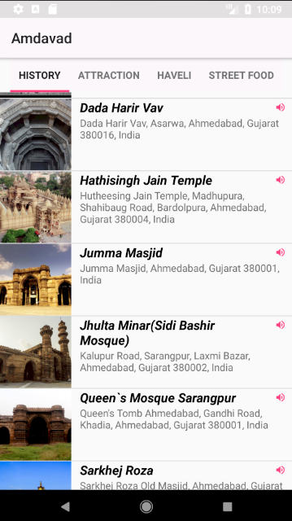
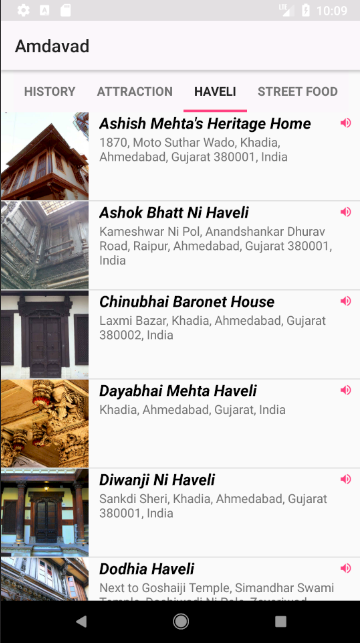
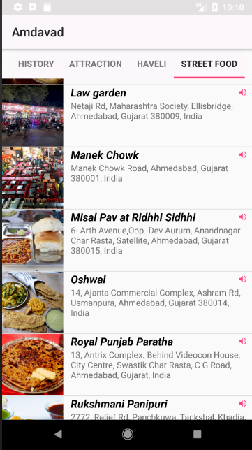

# Udacity and Google India Scholarship Program
## Android Basics Nanodegree Project 5 "Tour Guide App"

### Name of App - "Amdavad"

<b>This app features four things:</b>  
  1.) Historical Places in Ahmedabad  
  2.) Attraction (Best in Ahmedabad)  
  3.) Havelis in Ahmedabad  
  4.) Best Street Food in Ahmedabad  

Used ViewPager + Fragments as well as TabLayout to display the content. Also it is powered using Custom Array Adapter. 
## Amdavad App Images

  
 

Check out more Images in AppImages folder.
